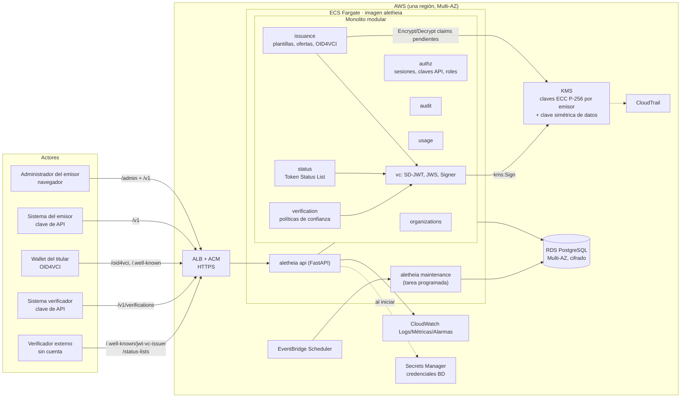
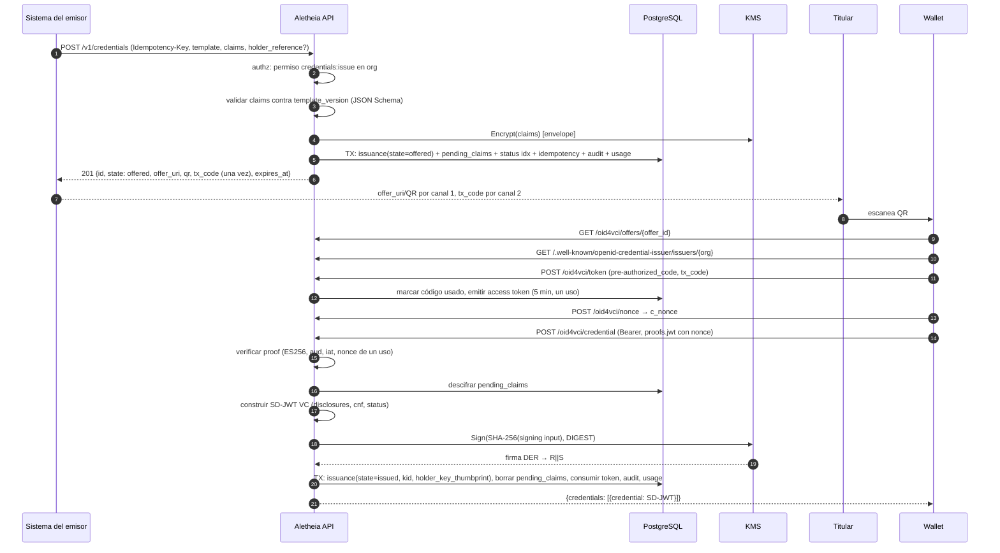
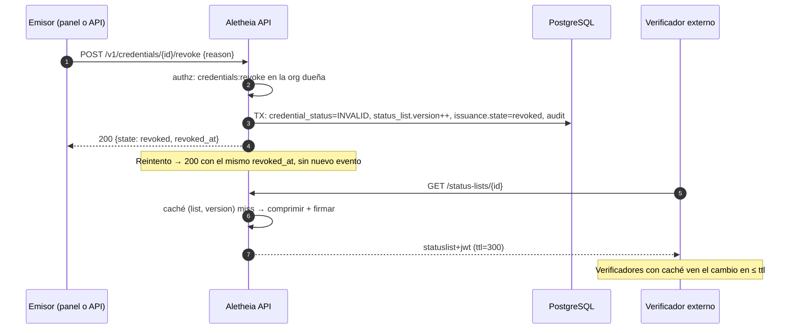

# 02 · Arquitectura

Estado: diseño del incremento 1 · Stack fijado por el cliente (ver ADR-0001)

## 1. Vista de componentes



### Superficies HTTP

| Prefijo | Tipo | Autenticación |
|---|---|---|
| `/v1/*` | API propia de Aletheia (OpenAPI) | Clave de API (`Authorization: Bearer ak_…`) o token de sesión del panel |
| `/oid4vci/*`, `/.well-known/openid-credential-issuer/…`, `/.well-known/oauth-authorization-server/…` | Endpoints exigidos por OID4VCI | Pre-authorized code / token de acceso OID4VCI |
| `/.well-known/jwt-vc-issuer/issuers/{id}` | Metadatos SD-JWT VC | Público |
| `/status-lists/{id}` | Token Status List | Público, cacheable |
| `/admin/*` | Panel estático | Login → token de sesión |
| `/healthz`, `/readyz` | Operación | Público (sin detalles internos) |

## 2. Módulos y responsabilidades

| Módulo | Responsabilidad | Tablas propias |
|---|---|---|
| `platform` | Configuración, sesión de BD, logging estructurado, errores estables, request-id, rate limit | `rate_limit_bucket`, `idempotency_record` |
| `organizations` | Organizaciones, usuarios, membresías, configuración de emisor, claves de firma (referencias) | `organization`, `user_account`, `membership`, `issuer_profile`, `signing_key` |
| `authz` | Login, sesiones, claves de API, roles → permisos, verificación por recurso | `session`, `api_client` |
| `issuance` | Plantillas versionadas, ofertas, OID4VCI, emisión, consulta, revocación (orquesta `status`) | `credential_template`, `template_version`, `issuance`, `issuance_pending_claims`, `oid4vci_nonce`, `oid4vci_access_token` |
| `status` | Asignación de índices, estado, generación y firma del Status List Token | `status_list`, `credential_status` |
| `verification` | Verificación con resultado desglosado, solicitudes de presentación, políticas de confianza | `presentation_request`, `trust_policy`, `trusted_issuer`, `verification_record` |
| `audit` | Registro append-only de acciones sensibles | `audit_event` |
| `usage` | Eventos de consumo por organización y agregados | `usage_event` |
| `vc` | Formato SD-JWT VC, JWS, `Signer` (local/KMS), Status List codec. Sin dependencias de web/BD. | — |

## 3. Secuencias

### 3.1 Emisión



Fallos:
- Firma OK pero la transacción final falla → no se responde la credencial, la firma se descarta; el token no queda consumido y el wallet puede reintentar.
- Transacción OK pero la respuesta se pierde → el token ya fue consumido; el emisor debe **reemitir** (nueva oferta). No se guarda la credencial para reenviarla (ADR-0009). Limitación documentada.
- Reintento de `POST /v1/credentials` con la misma `Idempotency-Key` y mismo cuerpo → misma respuesta (sin `tx_code`, que sólo se revela una vez; se puede regenerar con `POST /v1/credentials/{id}/offer:reset`). Mismo key y cuerpo distinto → `409 idempotency_key_reuse`.

### 3.2 Presentación y verificación

```mermaid
sequenceDiagram
  autonumber
  participant V as Verificador
  participant A as Aletheia API
  participant H as Titular / holder
  participant DB as PostgreSQL

  V->>A: POST /v1/presentation-requests {policy_id}
  A->>DB: guardar nonce (un uso), aud, expira 10 min
  A-->>V: {id, nonce, aud}
  V-->>H: nonce + aud (canal del verificador)
  H->>H: elegir disclosures, firmar KB-JWT(aud, nonce, iat, sd_hash) con clave del titular
  H-->>V: SD-JWT~disclosures~KB-JWT
  V->>A: POST /v1/verifications {presentation, presentation_request_id}
  A->>A: 1 estructura/formato
  A->>A: 2 resolver clave (BD si emisor alojado; HTTPS con allowlist si externo)
  A->>A: 3 firma del emisor (algoritmo permitido)
  A->>A: 4 digests de disclosures
  A->>A: 5 vigencia (nbf, exp, iat, desfase)
  A->>A: 6 estado (Status List: local o remoto con límites)
  A->>A: 7 confianza en el emisor (política)
  A->>A: 8 prueba de posesión (KB-JWT con cnf.jwk)
  A->>DB: 9 consumir nonce (anti-replay) + registro de verificación + usage
  A->>A: 10 política (vct aceptados, claims requeridos, antigüedad máx. de estado)
  A-->>V: {result: valid|invalid|indeterminate, checks[], disclosed_claims}
```

### 3.3 Revocación



Si la oferta aún no fue canjeada (`offered`), revocar la **cancela**: se borran los claims pendientes y el código deja de ser canjeable.

## 4. Autorización

Roles por membresía (una persona puede tener roles distintos en varias organizaciones):

| Permiso | owner | admin | issuer | verifier | auditor |
|---|:-:|:-:|:-:|:-:|:-:|
| `org:manage` (perfil de emisor, claves de firma) | ✔ | ✔ | | | |
| `members:manage` | ✔ | ✔ | | | |
| `api_clients:manage` | ✔ | ✔ | | | |
| `templates:write` | ✔ | ✔ | | | |
| `templates:read` | ✔ | ✔ | ✔ | | ✔ |
| `credentials:issue` | ✔ | ✔ | ✔ | | |
| `credentials:read` | ✔ | ✔ | ✔ | | ✔ |
| `credentials:revoke` | ✔ | ✔ | ✔ | | |
| `verifications:create` | ✔ | ✔ | | ✔ | |
| `trust_policies:write` | ✔ | ✔ | | | |
| `audit:read`, `usage:read` | ✔ | ✔ | | | ✔ |
| `signing_keys:compromise` | ✔ | | | | |

Las claves de API tienen un subconjunto explícito de permisos (nunca `members:manage` ni `signing_keys:compromise`). Todas las consultas se filtran por `organization_id` del principal en la capa de repositorio; un recurso de otra organización responde `404` (no `403`) para no revelar existencia. Defensa en profundidad adicional: Row-Level Security de PostgreSQL con `app.current_org` (implementada en el incremento 6, migración `0004`, [ADR-0012](adr/0012-row-level-security.md)).

## 5. Stack y justificación

| Capa | Elección | Motivo |
|---|---|---|
| Lenguaje / framework | Python 3.13 (imagen `python:3.13.15-slim-trixie`), FastAPI, Pydantic v2 | Fijado. OpenAPI generado desde los modelos. |
| Persistencia | PostgreSQL 16, SQLAlchemy 2 (sync), Alembic, psycopg 3 | Fijado. Sync por simplicidad; la carga del MVP no justifica async. |
| Criptografía | `cryptography`, `PyJWT`, AWS KMS | Mantenidas; ver ADR-0003/0006. |
| Hash de contraseñas | `argon2-cffi` (Argon2id) | Recomendación OWASP. |
| Frontend | HTML + JS (módulos ES), sin build | ADR-0010. |
| Pruebas | pytest, PostgreSQL real en CI (servicio de contenedor), `moto` para simular KMS | `moto` es simulación: **no** valida la integración real con AWS. |
| Calidad | Ruff (lint + formato), mypy estricto en `aletheia.vc` y `platform` | — |
| Empaquetado | `pyproject.toml` + `uv.lock` | Versiones reproducibles. |
| Infraestructura | Terraform ≥ 1.9, proveedor AWS ~> 6.x (versión exacta fijada en `.terraform.lock.hcl`) | Fijado. |
| CI | GitHub Actions + OIDC a AWS | Sin claves permanentes. |

## 6. Mapeo a servicios AWS

| Necesidad | Servicio | Uso en MVP |
|---|---|---|
| Cómputo | ECS Fargate | Servicio `api` (2 tareas, 2 AZ); tarea `migrate` (one-off); tarea `maintenance` (programada) |
| Imágenes | ECR | Inmutables, escaneo al subir |
| HTTPS | ALB + ACM | TLS 1.2+; HTTP→HTTPS |
| BD | RDS PostgreSQL | Multi-AZ en prod; cifrado KMS; PITR 7 días; `deletion_protection` |
| Firma | KMS | Claves ECC por emisor (creadas por la app con tags restringidos) |
| Datos pendientes | KMS (clave simétrica) | Envelope encryption de claims pendientes |
| Secretos | Secrets Manager | Credenciales de RDS gestionadas (`manage_master_user_password`) |
| Estáticos | — | El panel lo sirve la API (sin S3/CloudFront en MVP) |
| S3 | Sí | Estado de Terraform; logs de acceso del ALB |
| Colas | — | No necesarias (ADR-0008) |
| Programación | EventBridge Scheduler | `maintenance` cada 15 min (adición justificada) |
| Observabilidad | CloudWatch | Logs JSON, métricas EMF, alarmas |
| Auditoría AWS | CloudTrail | Eventos de gestión + uso de KMS |
| DNS | Route 53 | Sólo si hay dominio disponible |
