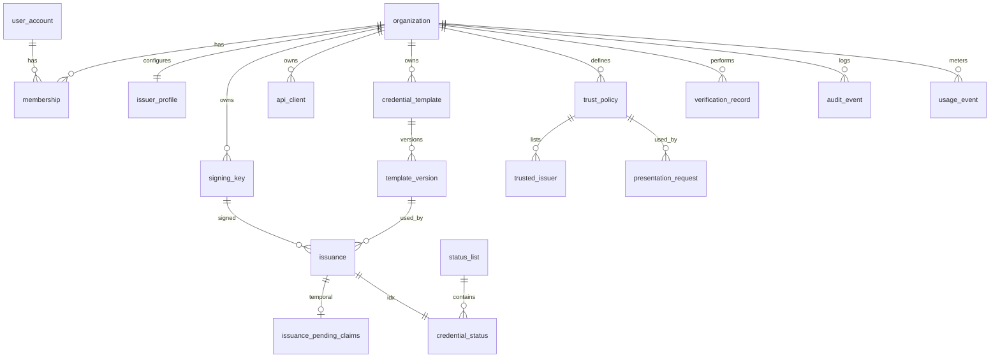

# 03 · Modelo de datos

Estado: diseño (las migraciones Alembic se escriben en el incremento 2).

Convenciones:
- Clave primaria `id UUID` (v7 generado en la aplicación, ordenable). Identificadores públicos con prefijo (`org_`, `cred_`, `tpl_`, `sl_`, `ak_`…) + 22 caracteres base62 aleatorios; nunca IDs secuenciales ni correos.
- Toda tabla de negocio tiene `organization_id UUID NOT NULL` (FK) y los índices compuestos empiezan por `organization_id`.
- `created_at`, `updated_at` `timestamptz` UTC.
- Clasificación: **P** = dato personal · **S** = secreto/credencial · **C** = confidencial de negocio · **Pub** = público.

## Entidades

### organization
| Campo | Tipo / restricción | Clasif. |
|---|---|---|
| id, public_id (`org_…`, único) | | Pub |
| name | text 1–200 | C |
| status | `active` \| `suspended` | C |
| data_retention_days | int, default 365 (auditoría/verificaciones) | C |
Retención: mientras exista contrato; baja → borrado lógico, purga a los 90 días salvo auditoría legalmente requerida.

### user_account
| Campo | Tipo / restricción | Clasif. |
|---|---|---|
| id | | |
| email | citext único (login; **nunca** identificador público) | P |
| display_name | text | P |
| password_hash | Argon2id | S |
| status | `active` \| `disabled` | |
| last_login_at | | P |
Sin `organization_id`: una persona puede pertenecer a varias organizaciones vía `membership`. Retención: hasta baja + 30 días; eventos de auditoría conservan sólo `actor_id`.

### membership
`id`, `organization_id` FK, `user_id` FK, `role` enum (`owner|admin|issuer|verifier|auditor`), único (`organization_id`, `user_id`). Índice (`user_id`). Clasif. C.

### session
`id`, `user_id`, `organization_id` (organización activa), `token_hash` (SHA-256 del token de 256 bits; único), `expires_at` (8 h), `revoked_at`, `ip_prefix` (/24, no IP completa). Clasif. S. Purga 7 días tras expirar.

### api_client (credencial de API)
| Campo | Tipo / restricción | Clasif. |
|---|---|---|
| id, organization_id | | |
| name | text | C |
| key_prefix | `ak_` + 8 caracteres, único (identifica sin revelar) | C |
| secret_hash | SHA-256 del secreto de 256 bits (alta entropía → no requiere KDF lento) | S |
| permissions | text[] ⊆ permisos permitidos para claves | C |
| expires_at | opcional, máx. 1 año | |
| revoked_at, last_used_at | | |
Índices: (`organization_id`, `revoked_at`). El secreto se muestra **una sola vez**. Rotación: crear nueva, revocar la anterior.

### issuer_profile (configuración del emisor)
`organization_id` PK/FK, `display_name`, `issuer_path_id` (= `org.public_id`), `default_credential_validity_days` (1–3650), `offer_ttl_hours` (1–168), `enabled`. Clasif. Pub (lo publicado en metadatos) / C.

### signing_key (referencia de clave de firma)
| Campo | Tipo / restricción | Clasif. |
|---|---|---|
| id, organization_id | | |
| kid | huella RFC 7638, único global | Pub |
| backend | `local_dev` \| `aws_kms` | C |
| key_ref | ARN de KMS o nombre de archivo local — **nunca material privado** | C |
| public_jwk | jsonb | Pub |
| alg | `ES256` (check) | Pub |
| state | `active` \| `retired` \| `compromised` | Pub/C |
| activated_at, retired_at, compromised_at | | |
Restricción: índice único parcial (`organization_id`) `WHERE state='active'`. Retención: indefinida (necesaria para verificar credenciales históricas y para auditoría).

### credential_template / template_version
`credential_template`: `id`, `organization_id`, `public_id` (`tpl_…`), `slug` (único por org; forma parte del `vct`), `name`, `archived_at`.

`template_version`: `id`, `organization_id`, `template_id`, `version` int (único por plantilla), `claims_schema` jsonb (JSON Schema restringido: sólo `object`, `string`, `integer`, `number`, `boolean`, `date`; profundidad ≤ 3; ≤ 50 propiedades), `selective_disclosure` text[] (rutas divulgables), `validity_days`, `display` jsonb (nombre, descripción, colores para wallets), `state` (`draft|published`). **Inmutable una vez publicada**; cambios → nueva versión. Clasif. C.

### issuance (registro operacional de emisión)
| Campo | Tipo / restricción | Clasif. |
|---|---|---|
| id, public_id (`cred_…`), organization_id | | |
| template_version_id | FK | |
| vct | text | Pub |
| state | `offered` \| `issued` \| `offer_expired` \| `revoked` | C |
| holder_reference | text ≤ 128, opcional, opaco, provisto por el emisor | P (seudónimo) |
| offer_id | aleatorio 128 bits, único | S |
| pre_auth_code_hash, tx_code_hash, tx_code_attempts | hashes; `tx_code` Argon2id (espacio pequeño) | S |
| offer_expires_at | | |
| signing_key_id | FK (se fija al emitir) | |
| holder_key_thumbprint | RFC 7638 de `cnf.jwk` | P (seudónimo) |
| status_list_id, status_idx | FK, único (lista, idx) | C |
| issued_at, expires_at (de la credencial) | | |
| revoked_at, revocation_reason_code, revoked_by | reason: `superseded\|issued_in_error\|holder_request\|policy_violation\|key_compromise\|other` | C |
**No contiene los atributos de la credencial.** Índices: (`organization_id`, `created_at DESC`), (`organization_id`, `state`), (`organization_id`, `holder_reference`), único (`offer_id`). Retención: vida de la credencial + `data_retention_days`.

Estados observables en el panel: `offered` (oferta creada), `issued` (**recepción confirmada**: el wallet canjeó la oferta), `offer_expired`, `revoked`, y "expirada" calculada cuando `expires_at < now()`.

### issuance_pending_claims
`issuance_id` PK/FK, `organization_id`, `ciphertext` bytea, `encrypted_data_key` bytea, `key_ref`. Clasif. **P**. Se elimina al emitir, expirar o cancelar; `maintenance` purga cualquier residuo con `offer_expires_at < now()`. Máx. 7 días.

### status_list / credential_status
`status_list`: `id`, `public_id` (`sl_…`), `organization_id`, `bits` (=1), `size` (131072), `allocated` int, `version` bigint, `signing_key_id` (para el token), `state` (`open|full`).

`credential_status`: (`status_list_id`, `idx`) PK, `organization_id`, `value` smallint (0/1), `updated_at`. Asignación: índice aleatorio con reintento ante colisión (restricción PK). Retención: mientras la lista esté publicada (vida máxima de credenciales + margen).

### trust_policy / trusted_issuer (política de confianza del verificador)
`trust_policy`: `id`, `organization_id`, `name`, `accepted_vcts` text[], `required_claims` text[], `require_holder_binding` bool (default true), `require_status` bool (default true), `max_status_age_seconds` (default 900 = `ttl` del servidor + caché del cliente), `clock_skew_seconds` (default 60, ≤ 300), `max_kb_age_seconds` (default 300). No existe opción para aceptar un estado inalcanzable: la indisponibilidad siempre produce `indeterminate`.

`trusted_issuer`: `id`, `organization_id`, `trust_policy_id`, `issuer` (URL `iss` exacta), `hosted_org_id` (si es un emisor de Aletheia), `note`. Único (`trust_policy_id`, `issuer`). Un emisor **no** es confiable por estar alojado en Aletheia: debe estar listado.

### presentation_request
`id`, `organization_id`, `trust_policy_id`, `nonce_hash` único, `aud`, `expires_at` (≤ 10 min), `consumed_at`. Purga 24 h tras expirar.

### verification_record
`id`, `organization_id`, `presentation_request_id?`, `result` (`valid|invalid|indeterminate`), `checks` jsonb (códigos, sin valores de claims), `issuer`, `vct`, `credential_ref` (`issuance_id` si es emisor alojado), `created_at`. **No guarda la presentación ni claims divulgados.** Retención: `data_retention_days`.

### audit_event
`id`, `organization_id`, `occurred_at`, `actor_type` (`user|api_client|system|holder`), `actor_id`, `action` (p. ej. `credential.revoked`), `target_type`, `target_id`, `request_id`, `metadata` jsonb (sin datos personales). Append-only: el rol de la aplicación sólo tiene `INSERT, SELECT` sobre la tabla. Índices (`organization_id`, `occurred_at DESC`), (`organization_id`, `target_id`). Retención: `data_retention_days` (mín. 365).

### usage_event
`id`, `organization_id`, `occurred_at`, `kind` (`credential.offered|credential.issued|verification.performed|status_list.served`), `api_client_id?`, `quantity`. Índice (`organization_id`, `kind`, `occurred_at`). Agregación mensual por consulta. Retención 24 meses (base para facturación futura).

### idempotency_record
(`organization_id`, `key`) PK, `request_hash` (SHA-256 del cuerpo canónico), `response_status`, `response_body` jsonb (sin `tx_code`), `resource_id`, `expires_at` (24 h).

### oid4vci_nonce / oid4vci_access_token
`nonce_hash` PK, `expires_at` (5 min), `consumed_at`. Access token: `token_hash` PK, `issuance_id`, `expires_at`, `consumed_at`. Clasif. S. Purga horaria.

### rate_limit_bucket
(`subject`, `window_start`) PK, `count`. Purga tras la ventana.

## Diagrama entidad-relación (simplificado)

